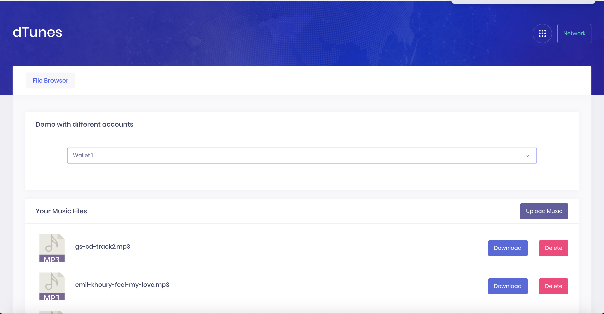

# dTunes
 This repository uses SKALE storage and contracts to manage music files over IPFS.

As MetaMask was not working with filestorage.js, I used truffle-hdwallet-provider to create 2 wallets and accounts that are used to demo the upload, download and delete functionality of the filestorage.

I have also written a contract that records the list of addresses that are uploading files to the storage, this list is then fetched to show all files available within the contract.

# Run Demo

To run, simply clone the repo and then use 'http-server' command to run the server. Open the given localhost URL in the browser to interact with the project.

I have used browserify to convert the node based hdwallet and filestorage.js, its static now and this package can be pushed on to IPFS.

# Screenshot

# Demo Video

## Future Work

Demo could not work with MetaMask due to issues with filestorage.js, storing privatekeys in code-base is not a good idea. Need to convert that to MetaMask once we have the issues fixed.

Also, could not complete the "Buy" functionality due to the shortage of time towards the end of the hackathon. This is a pending issue that will be resolved later.

